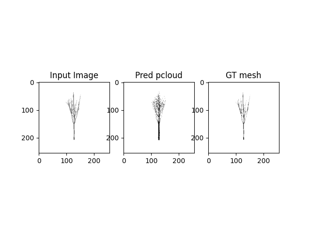
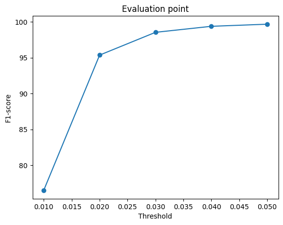

# L3D_project_SV3D_tree


# setup
1. Download dataset folder from Google Drive and move into data directory
```
mv `path_to_dataset` `path_to_project/data`
```

# training for unit test
Verify pix2pcloud for a single item from dataset.
```
python train.py --unit_test True --batch_size 1 --viz_debug True --max_iter 1000
```


# training full
Verify pix2pcloud for a single item from dataset.
```
python train.py  --batch_size 16  --max_iter 10000
```

# evaluate the model
Ensure the right checkpt.pth is set. Run python script to get F1 score.

```
python eval_model.py --type 'point' --load_checkpoint
```

